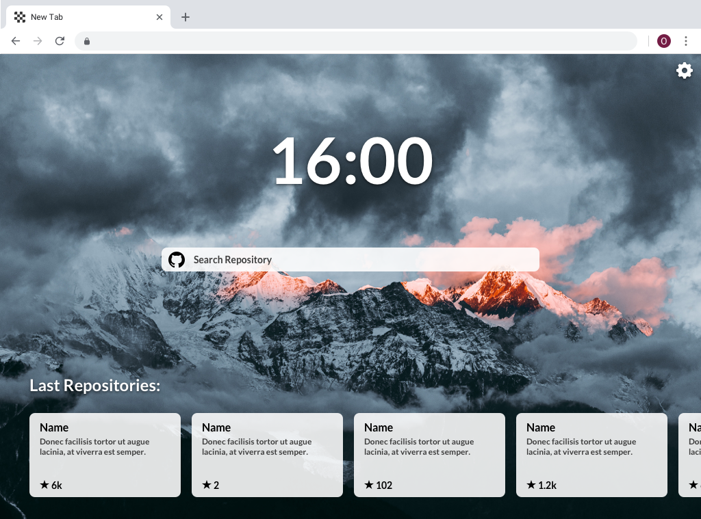
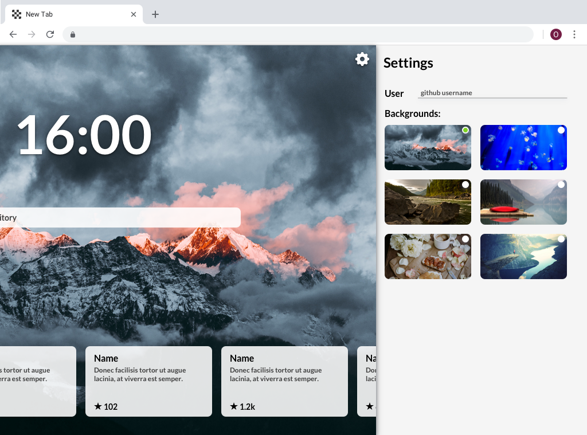

# New Tab Github

_A "New Tab Page" for developers, search in your repositories and see the latest_

## Preview

## Features

1. show current time
1. show recent repositories
1. search in user repositories

---

### Extra

1. Change new tab page user (github)
1. Multiple backgrounds:

   - user can choose background

   - on page reload chosen background needs to remain

1. menu open and close animations
